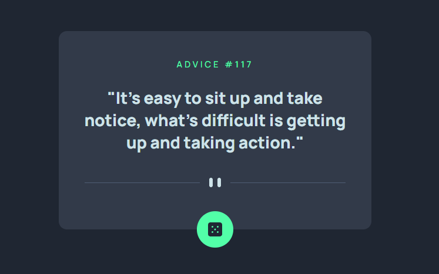

# Frontend Mentor - Advice generator app solution

This is a solution to the [Advice generator app challenge on Frontend Mentor](https://www.frontendmentor.io/challenges/advice-generator-app-QdUG-13db). Frontend Mentor challenges help you improve your coding skills by building realistic projects.

## Table of contents

- [Overview](#overview)
  - [The challenge](#the-challenge)
  - [Screenshot](#screenshot)
  - [Links](#links)
- [My process](#my-process)
  - [Built with](#built-with)
  - [What I learned](#what-i-learned)
  - [Continued development](#continued-development)
  - [Useful resources](#useful-resources)
- [Author](#author)

## Overview

### The challenge

Users should be able to:

- View the optimal layout for the app depending on their device's screen size
- See hover states for all interactive elements on the page
- Generate a new piece of advice by clicking the dice icon

### Screenshot



### Links

- Solution URL: [GitHub](https://github.com/min4899/Frontend-Mentor-Advice-Generator-App)
- Live Site URL: [GitHub Pages](https://min4899.github.io/Frontend-Mentor-Advice-Generator-App/)

## My process

### Built with

- Semantic HTML5 markup
- CSS custom properties
- Flexbox

### What I learned

Learned how to use JavaScript functions for API calls. 1st function uses async await for fetching data from the Advice Slip API. 2nd function uses promise to take data after calling 1st function then changing text content.

```js
async function getAdvice() {
  let response = await fetch('https://api.adviceslip.com/advice');  
  let data = await response.json();
  return data;
}

function printAdvice() {
  getAdvice().then(data => {
    adviceId.textContent = `Advice #${data.slip.id}`;
    adviceMsg.textContent = `"${data.slip.advice}"`;
  });
}
```

### Continued development

Work with more JavaScript challenges.

### Useful resources

- [Using the Fetch API](https://developer.mozilla.org/en-US/docs/Web/API/Fetch_API/Using_Fetch) - MDN Web documentation on how to use Fetch API.
- [All possible ways of making an API call in JavaScript](https://levelup.gitconnected.com/all-possible-ways-of-making-an-api-call-in-plain-javascript-c0dee3c11b8b) - Used the promise and async await methods for fetch.

## Author

- GitHub - [Minwoo Soh](https://github.com/min4899)
- Frontend Mentor - [@min4899](https://www.frontendmentor.io/profile/min4899)
